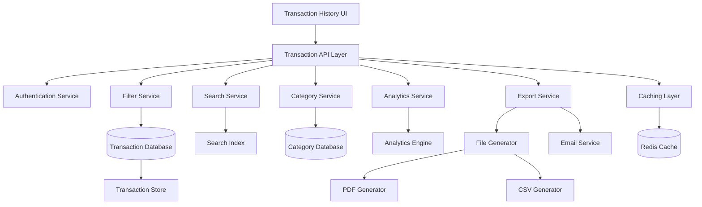

# Enhanced Transaction History - Design Document

## Overview

The Enhanced Transaction History system provides comprehensive transaction management capabilities including advanced filtering, search, categorization, analytics, and export functionality. This system transforms the basic transaction listing into a powerful financial analysis tool that helps users understand and manage their financial activity.

## Architecture

### System Components



### Service Architecture

The enhanced transaction history system follows a modular architecture with clear separation of concerns:

- **Filter Service**: Advanced filtering with multiple criteria
- **Search Service**: Full-text search across transaction fields
- **Category Service**: Transaction categorization and management
- **Analytics Service**: Financial insights and trend analysis
- **Export Service**: Data export in multiple formats
- **Caching Layer**: Performance optimization for frequent queries

## Components and Interfaces

### Filter Service Component

**Responsibilities:**
- Multi-criteria transaction filtering
- Filter persistence across sessions
- Filter combination logic
- Performance optimization for large datasets

**Key Interfaces:**
```typescript
interface FilterService {
  applyFilters(userId: string, filters: TransactionFilters): Promise<FilteredResult>
  saveFilterPreset(userId: string, preset: FilterPreset): Promise<void>
  getFilterPresets(userId: string): Promise<FilterPreset[]>
  combineFilters(filters: TransactionFilter[]): TransactionQuery
}

interface TransactionFilters {
  dateRange?: {
    startDate: Date
    endDate: Date
  }
  types?: TransactionType[]
  statuses?: TransactionStatus[]
  amountRange?: {
    min: number
    max: number
  }
  categories?: string[]
  searchQuery?: string
}

interface FilteredResult {
  transactions: Transaction[]
  totalCount: number
  appliedFilters: TransactionFilters
  executionTime: number
}
```

### Search Service Component

**Responsibilities:**
- Full-text search across transaction fields
- Search suggestions and autocomplete
- Search result highlighting
- Search performance optimization

**Key Interfaces:**
```typescript
interface SearchService {
  searchTransactions(userId: string, query: string, filters?: TransactionFilters): Promise<SearchResult>
  getSearchSuggestions(userId: string, partial: string): Promise<string[]>
  highlightSearchTerms(text: string, query: string): string
  indexTransaction(transaction: Transaction): Promise<void>
}

interface SearchResult {
  transactions: Transaction[]
  highlights: Record<string, string[]>
  totalMatches: number
  searchTime: number
}
```

### Category Service Component

**Responsibilities:**
- Transaction categorization management
- Category suggestions based on transaction data
- Bulk categorization operations
- Category-based analytics

**Key Interfaces:**
```typescript
interface CategoryService {
  getCategories(userId: string): Promise<Category[]>
  createCategory(userId: string, category: CreateCategoryRequest): Promise<Category>
  assignCategory(transactionId: string, categoryId: string): Promise<void>
  bulkCategorize(transactionIds: string[], categoryId: string): Promise<BulkResult>
  suggestCategory(transaction: Transaction): Promise<CategorySuggestion[]>
  getCategoryStats(userId: string, period: DateRange): Promise<CategoryStats>
}

interface Category {
  id: string
  name: string
  color: string
  icon?: string
  isDefault: boolean
  userId: string
  createdAt: Date
}

interface CategorySuggestion {
  category: Category
  confidence: number
  reason: string
}
```

### Analytics Service Component

**Responsibilities:**
- Financial trend analysis
- Spending pattern insights
- Comparative analytics
- Chart data generation

**Key Interfaces:**
```typescript
interface AnalyticsService {
  getSpendingTrends(userId: string, period: DateRange): Promise<SpendingTrends>
  getCategoryBreakdown(userId: string, period: DateRange): Promise<CategoryBreakdown>
  getTransactionInsights(userId: string): Promise<TransactionInsights>
  comparePerformance(userId: string, period1: DateRange, period2: DateRange): Promise<PeriodComparison>
}

interface SpendingTrends {
  monthlyTrends: MonthlyTrend[]
  averagesByType: Record<TransactionType, number>
  topRecipients: RecipientStats[]
  unusualPatterns: UnusualPattern[]
}

interface TransactionInsights {
  totalSpending: number
  averageTransaction: number
  mostActiveDay: string
  largestTransaction: Transaction
  spendingVelocity: number
}
```

### Export Service Component

**Responsibilities:**
- Multi-format data export (CSV, PDF)
- Large dataset handling
- Email delivery for exports
- Export job management

**Key Interfaces:**
```typescript
interface ExportService {
  exportTransactions(userId: string, format: ExportFormat, filters?: TransactionFilters): Promise<ExportResult>
  getExportStatus(exportId: string): Promise<ExportStatus>
  scheduleExport(userId: string, request: ExportRequest): Promise<string>
  emailExport(exportId: string, email: string): Promise<void>
}

interface ExportRequest {
  format: 'CSV' | 'PDF'
  filters?: TransactionFilters
  includeAnalytics?: boolean
  emailDelivery?: boolean
}

interface ExportResult {
  exportId: string
  downloadUrl?: string
  status: 'PROCESSING' | 'COMPLETED' | 'FAILED'
  fileSize?: number
  recordCount: number
}
```

## Data Models

### Enhanced Transaction Schema

```typescript
interface EnhancedTransaction extends Transaction {
  category?: Category
  tags: string[]
  notes?: string
  receiptUrl?: string
  receiptStatus: 'NONE' | 'GENERATING' | 'AVAILABLE' | 'FAILED'
  searchableText: string  // Computed field for search
  displayAmount: string   // Formatted amount with currency
  relatedTransactions?: string[]  // For grouped transactions
}
```

### Filter Preset Schema

```typescript
interface FilterPreset {
  id: string
  userId: string
  name: string
  filters: TransactionFilters
  isDefault: boolean
  createdAt: Date
  lastUsed: Date
}
```

### Analytics Cache Schema

```typescript
interface AnalyticsCache {
  id: string
  userId: string
  cacheKey: string
  data: any
  expiresAt: Date
  createdAt: Date
}
```

## Correctness Properties

*A property is a characteristic or behavior that should hold true across all valid executions of a system-essentially, a formal statement about what the system should do. Properties serve as the bridge between human-readable specifications and machine-verifiable correctness guarantees.*

### Property Reflection

After reviewing all properties identified in the prework analysis, I've identified several areas where properties can be consolidated:

- Properties 1.1, 1.2, 1.3, 1.4 can be combined into a comprehensive filtering property
- Properties 2.2, 2.3, 2.4 can be combined into search functionality property
- Properties 4.1, 4.2, 4.3, 4.4 can be combined into export completeness property
- Properties 5.1, 5.2, 5.3, 5.4, 5.5 can be combined into display formatting property
- Properties 6.1, 6.2, 6.3, 6.4 can be combined into analytics calculation property

### Core Properties

**Property 1: Multi-Criteria Filtering Consistency**
*For any* combination of date range, transaction type, status, and amount filters, the system should return only transactions that match all specified criteria
**Validates: Requirements 1.1, 1.2, 1.3, 1.4, 1.5**

**Property 2: Filter Persistence Across Sessions**
*For any* user filter configuration, the settings should be restored when the user returns to the application
**Validates: Requirements 1.6**

**Property 3: Comprehensive Search Functionality**
*For any* search query, the system should search across transaction descriptions, references, and recipient names, support partial matching, and highlight results
**Validates: Requirements 2.2, 2.3, 2.4**

**Property 4: Search and Filter Integration**
*For any* combination of search query and filters, both criteria should be applied simultaneously to return accurate results
**Validates: Requirements 2.5**

**Property 5: Search Suggestion Relevance**
*For any* partial search input, suggestions should be based on the user's transaction history and be relevant to the input
**Validates: Requirements 2.6**

**Property 6: Category Management Operations**
*For any* valid category name, users should be able to create custom categories and assign them to transactions
**Validates: Requirements 3.2, 3.3**

**Property 7: Bulk Categorization Consistency**
*For any* set of transactions and category, bulk categorization should assign the category to all selected transactions atomically
**Validates: Requirements 3.4**

**Property 8: Category Suggestion Accuracy**
*For any* transaction description, category suggestions should be relevant and based on historical patterns
**Validates: Requirements 3.5**

**Property 9: Category-Based Filtering**
*For any* selected category, filtering should return only transactions assigned to that category
**Validates: Requirements 3.6**

**Property 10: Export Format Completeness**
*For any* transaction dataset, exports in CSV and PDF formats should include all required transaction details (date, amount, type, status, description)
**Validates: Requirements 4.1, 4.2, 4.4**

**Property 11: Filtered Export Accuracy**
*For any* applied filters, exported data should contain only transactions that match the filter criteria
**Validates: Requirements 4.3**

**Property 12: Export Email Delivery**
*For any* large export request, download links should be generated and delivered via email when requested
**Validates: Requirements 4.6**

**Property 13: Transaction Display Formatting**
*For any* transaction, the display should show properly formatted amounts, dates in user timezone, status indicators, and recipient information when available
**Validates: Requirements 5.1, 5.2, 5.3, 5.4, 5.5**

**Property 14: Expandable Transaction Details**
*For any* transaction, users should be able to expand to view additional details
**Validates: Requirements 5.6**

**Property 15: Analytics Calculation Accuracy**
*For any* time period and transaction data, analytics should correctly calculate spending totals by category, averages by type, and top recipients
**Validates: Requirements 6.1, 6.2, 6.3, 6.4**

**Property 16: Period Comparison Consistency**
*For any* two time periods, spending comparisons should accurately reflect the differences between the periods
**Validates: Requirements 6.5**

**Property 17: Unusual Pattern Detection**
*For any* transaction dataset with known unusual patterns, the system should identify and report these patterns
**Validates: Requirements 6.6**

**Property 18: Pagination Configuration**
*For any* valid page size (10, 20, 50, 100), the system should display the correct number of transactions per page
**Validates: Requirements 7.3**

**Property 19: Infinite Scroll Functionality**
*For any* scroll action, additional transaction data should load seamlessly when available
**Validates: Requirements 7.4**

**Property 20: Pagination Count Accuracy**
*For any* transaction dataset, the system should display accurate total counts and current page position
**Validates: Requirements 7.5**

**Property 21: Data Caching Efficiency**
*For any* repeated request for the same transaction data, the system should utilize cached results for improved performance
**Validates: Requirements 7.6**

**Property 22: Receipt Integration Completeness**
*For any* completed transaction, receipt generation links should be available and functional
**Validates: Requirements 8.1, 8.4**

**Property 23: Receipt Status Accuracy**
*For any* receipt request, the system should accurately display the current status (available, generating, failed)
**Validates: Requirements 8.2**

**Property 24: Bulk Receipt Generation**
*For any* set of transactions, bulk receipt generation should create receipts for all selected transactions
**Validates: Requirements 8.3**

**Property 25: Receipt Caching and Sharing**
*For any* generated receipt, it should be cached for quick access and provide sharing options (email, download)
**Validates: Requirements 8.5, 8.6**

## Error Handling

### Filter and Search Errors
- **Invalid Date Ranges**: Clear error messages for invalid or impossible date ranges
- **Search Query Limits**: Handling of very long or complex search queries
- **Filter Conflicts**: Resolution of conflicting filter criteria
- **Performance Timeouts**: Graceful handling of slow filter operations

### Export Errors
- **Large Dataset Limits**: Appropriate handling of exports exceeding system limits
- **Format Generation Failures**: Retry mechanisms for failed PDF/CSV generation
- **Email Delivery Failures**: Fallback options when email delivery fails
- **Storage Limitations**: Handling of insufficient storage for large exports

### Analytics Errors
- **Insufficient Data**: Appropriate messaging when insufficient data for analytics
- **Calculation Errors**: Error handling for mathematical operations
- **Chart Generation Failures**: Fallback for visualization errors
- **Cache Invalidation**: Proper handling of stale cached analytics

## Testing Strategy

### Unit Testing
- Filter logic and combination algorithms
- Search indexing and query processing
- Category assignment and suggestion algorithms
- Export format generation
- Analytics calculation functions

### Property-Based Testing
Each correctness property will be implemented as a property-based test with minimum 100 iterations:

- **Property 1**: Test filtering with random filter combinations
- **Property 2**: Test filter persistence across simulated sessions
- **Property 3**: Test search functionality with random queries and data
- **Property 4**: Test search-filter integration with random combinations
- **Property 5**: Test search suggestions with various input patterns
- **Property 6-9**: Test category operations with random data
- **Property 10-12**: Test export functionality with various datasets
- **Property 13-14**: Test display formatting with random transaction data
- **Property 15-17**: Test analytics calculations with known datasets
- **Property 18-21**: Test pagination and caching with various configurations
- **Property 22-25**: Test receipt integration with random transaction sets

### Integration Testing
- End-to-end transaction filtering workflows
- Search and filter combination scenarios
- Export generation and delivery processes
- Analytics dashboard functionality
- Receipt integration with transaction history

### Performance Testing
- Large dataset filtering performance
- Search response times with various query types
- Export generation times for different data sizes
- Analytics calculation performance
- Caching effectiveness measurement

This design provides a comprehensive, scalable, and user-friendly enhanced transaction history system that transforms basic transaction listing into a powerful financial management tool.