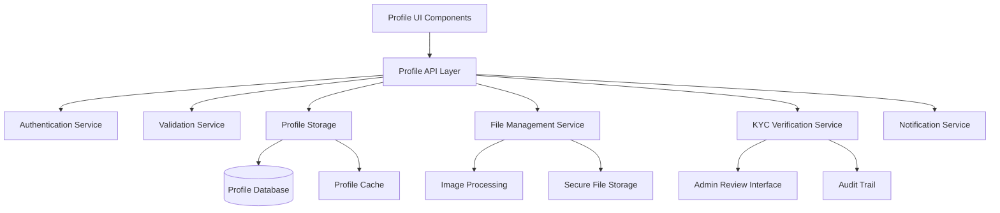

# User Profile Management - Design Document

## Overview

The User Profile Management system provides comprehensive profile management capabilities including personal information editing, avatar management, KYC document verification, and privacy controls. This system serves as the foundation for user identity and compliance across the Bridge platform.

## Architecture

### System Components



### Service Architecture

The profile management system follows a microservices approach with clear separation of concerns:

- **Profile Service**: Core profile data management
- **KYC Service**: Document verification and compliance
- **File Service**: Avatar and document storage
- **Validation Service**: Data validation and verification
- **Notification Service**: User communications

## Components and Interfaces

### Profile Management Component

**Responsibilities:**
- User profile CRUD operations
- Profile completion tracking
- Privacy settings management
- Data validation and sanitization

**Key Interfaces:**
```typescript
interface ProfileService {
  getProfile(userId: string): Promise<UserProfile>
  updateProfile(userId: string, updates: ProfileUpdate): Promise<UserProfile>
  getProfileCompletion(userId: string): Promise<ProfileCompletion>
  setPrivacySettings(userId: string, settings: PrivacySettings): Promise<void>
  exportUserData(userId: string): Promise<UserDataExport>
  deleteAccount(userId: string): Promise<void>
}

interface UserProfile {
  id: string
  email: string
  phone: string
  name: string
  avatar?: string
  dateOfBirth?: Date
  address?: Address
  kycStatus: KYCStatus
  profileCompletion: number
  privacySettings: PrivacySettings
  preferences: UserPreferences
  createdAt: Date
  updatedAt: Date
}
```

### KYC Verification Component

**Responsibilities:**
- Document upload and validation
- KYC workflow management
- Admin review interface
- Compliance audit trail

**Key Interfaces:**
```typescript
interface KYCService {
  uploadDocument(userId: string, document: DocumentUpload): Promise<KYCDocument>
  getDocuments(userId: string): Promise<KYCDocument[]>
  submitForReview(userId: string): Promise<KYCSubmission>
  reviewSubmission(submissionId: string, decision: KYCDecision): Promise<void>
  getPendingReviews(): Promise<KYCSubmission[]>
  getAuditTrail(userId: string): Promise<KYCAuditEntry[]>
}

interface KYCDocument {
  id: string
  userId: string
  type: DocumentType
  filename: string
  uploadedAt: Date
  status: DocumentStatus
}

interface KYCDecision {
  approved: boolean
  reason?: string
  reviewedBy: string
  reviewedAt: Date
}
```

### File Management Component

**Responsibilities:**
- Avatar upload and processing
- Document storage and retrieval
- Image optimization and resizing
- Secure file access controls

**Key Interfaces:**
```typescript
interface FileService {
  uploadAvatar(userId: string, file: File): Promise<AvatarUpload>
  uploadDocument(userId: string, file: File, type: DocumentType): Promise<DocumentUpload>
  getFile(fileId: string, userId: string): Promise<FileAccess>
  deleteFile(fileId: string, userId: string): Promise<void>
  generateDefaultAvatar(initials: string): Promise<string>
}

interface AvatarUpload {
  url: string
  thumbnailUrl: string
  originalSize: number
  processedSize: number
}
```

## Data Models

### User Profile Schema

```typescript
interface UserProfile {
  id: string                    // Primary key
  email: string                 // Unique, validated
  phone: string                 // Unique, validated
  name: string                  // Full name
  avatar?: string               // Avatar URL
  dateOfBirth?: Date           // Optional for age verification
  address?: {
    street: string
    city: string
    country: string
    postalCode: string
  }
  kycStatus: 'PENDING' | 'VERIFIED' | 'REJECTED'
  profileCompletion: number     // Percentage 0-100
  privacySettings: {
    profileVisibility: 'PUBLIC' | 'PRIVATE'
    showEmail: boolean
    showPhone: boolean
    showAddress: boolean
  }
  preferences: {
    language: string
    notifications: {
      email: boolean
      sms: boolean
      push: boolean
    }
    twoFactorEnabled: boolean
  }
  createdAt: Date
  updatedAt: Date
}
```

### KYC Document Schema

```typescript
interface KYCDocument {
  id: string
  userId: string
  type: 'ID_CARD' | 'PASSPORT' | 'UTILITY_BILL' | 'BANK_STATEMENT'
  filename: string
  originalName: string
  mimeType: string
  size: number
  url: string
  uploadedAt: Date
  status: 'PENDING' | 'APPROVED' | 'REJECTED'
  rejectionReason?: string
  reviewedBy?: string
  reviewedAt?: Date
}
```

### Audit Trail Schema

```typescript
interface ProfileAuditEntry {
  id: string
  userId: string
  action: string
  changes: Record<string, any>
  performedBy: string
  performedAt: Date
  ipAddress: string
  userAgent: string
}
```

## Correctness Properties

*A property is a characteristic or behavior that should hold true across all valid executions of a system-essentially, a formal statement about what the system should do. Properties serve as the bridge between human-readable specifications and machine-verifiable correctness guarantees.*

### Property Reflection

After reviewing all properties identified in the prework analysis, I've identified several areas where properties can be consolidated:

- Properties 1.1, 1.2, 1.3 can be combined into a comprehensive profile management property
- Properties 2.2, 2.3 can be combined into file validation property
- Properties 7.1, 7.2, 7.5, 7.6 can be combined into avatar management property
- Properties 8.2, 8.3, 8.6 can be combined into API security and consistency property

### Core Properties

**Property 1: Profile Management Consistency**
*For any* user profile update operation, the system should validate inputs, save changes atomically, and provide success confirmation
**Validates: Requirements 1.1, 1.2, 1.3**

**Property 2: Avatar Processing Standardization**
*For any* uploaded avatar image, the system should resize it to 200x200px dimensions and provide both upload and removal functionality
**Validates: Requirements 1.5, 7.2, 7.6**

**Property 3: File Upload Validation**
*For any* file upload attempt, the system should validate file type and size according to specified rules (PDF/JPG/PNG, max 5MB)
**Validates: Requirements 2.2, 2.3**

**Property 4: KYC State Transitions**
*For any* KYC document upload, the verification status should transition to PENDING, and admin decisions should update status to VERIFIED or REJECTED
**Validates: Requirements 2.4, 3.4, 3.5**

**Property 5: Audit Trail Completeness**
*For any* profile modification or KYC decision, an audit entry should be created with timestamp, user, and change details
**Validates: Requirements 3.6, 5.2**

**Property 6: Privacy Settings Enforcement**
*For any* profile data access, the system should respect user privacy settings and only expose permitted information
**Validates: Requirements 5.4, 8.3**

**Property 7: Authentication Requirements**
*For any* profile operation (view, edit, delete), the system should verify user authentication before proceeding
**Validates: Requirements 5.3, 8.2**

**Property 8: Profile Completion Tracking**
*For any* user profile, the system should calculate completion percentage based on filled mandatory fields and display it accurately
**Validates: Requirements 6.6**

**Property 9: Duplicate Prevention**
*For any* new user registration, the system should prevent duplicate accounts using the same email or phone number
**Validates: Requirements 6.5**

**Property 10: Default Avatar Generation**
*For any* user without an uploaded avatar, the system should generate a default avatar using user initials
**Validates: Requirements 7.5**

**Property 11: Data Encryption at Rest**
*For any* sensitive profile information stored in the database, the data should be encrypted using strong encryption algorithms
**Validates: Requirements 5.1**

**Property 12: Feature Access Control**
*For any* user with incomplete profile information, the system should restrict access to advanced platform features
**Validates: Requirements 6.4**

## Error Handling

### Validation Errors
- **Invalid File Types**: Clear error messages for unsupported file formats
- **File Size Limits**: Specific feedback when files exceed 5MB limit
- **Required Fields**: Highlight missing mandatory profile fields
- **Format Validation**: Email and phone number format validation errors

### System Errors
- **Upload Failures**: Retry mechanisms for file upload failures
- **Processing Errors**: Graceful handling of image processing failures
- **Database Errors**: Transaction rollback for profile update failures
- **External Service Errors**: Fallback for notification service failures

### Security Errors
- **Authentication Failures**: Clear unauthorized access messages
- **Permission Denied**: Appropriate error responses for privacy violations
- **Rate Limiting**: Informative messages when rate limits are exceeded
- **Malicious Files**: Security scanning and rejection of harmful uploads

## Testing Strategy

### Unit Testing
- Profile validation logic
- Image processing functions
- KYC workflow state machines
- Privacy setting enforcement
- API endpoint functionality

### Property-Based Testing
Each correctness property will be implemented as a property-based test with minimum 100 iterations:

- **Property 1**: Test profile updates with random valid data
- **Property 2**: Test avatar processing with various image sizes and formats
- **Property 3**: Test file validation with random file types and sizes
- **Property 4**: Test KYC state transitions with various scenarios
- **Property 5**: Test audit trail creation for all operations
- **Property 6**: Test privacy enforcement with different settings
- **Property 7**: Test authentication requirements for all endpoints
- **Property 8**: Test completion percentage calculation
- **Property 9**: Test duplicate prevention with various inputs
- **Property 10**: Test default avatar generation
- **Property 11**: Test data encryption verification
- **Property 12**: Test feature access control

### Integration Testing
- End-to-end profile management workflows
- KYC document upload and review process
- File upload and storage integration
- Notification system integration
- Admin interface functionality

### Security Testing
- File upload security scanning
- Authentication bypass attempts
- Privacy setting violations
- Data encryption verification
- Access control testing

This design provides a comprehensive, secure, and scalable user profile management system that meets all requirements while maintaining high performance and user experience standards.